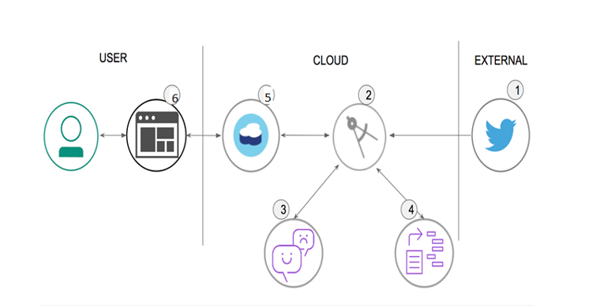

# IBM_Cognitive-Social-CRM-App
 Configure subscription to a Twitter feed and analyze each tweet received for emotional tone and sentiment. Store all data in a Cloudant database (in order to store historical data as well). Then, present the resulting analysis in a Web UI as a series of graphs and charts.

#### Flow

####1.	Tweets are pushed out by Twitter.
####2.	The application processes the tweet.
####3.	The Watson Tone Analyzer Service performs analysis of sentiment and emotional tone.
####4.	The Watson Natural Language Understanding Service pulls out keywords and entities.
####5.	Tweets and metadata are stored in Cloudant 
####6.	The Web UI displays charts and graphs as well as the tweets.
